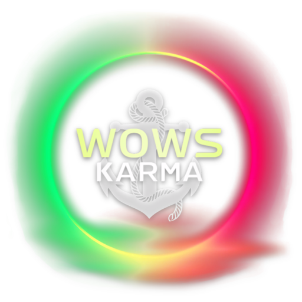

# WOWS Karma

### The Persistent and Comprehensive Karma system for World of Warships.  ([wows-karma.com](https://wows-karma.com))

**WOWS Karma is a reputation system for Wargaming's hit game World of Warships.**  

Based on player-driven content, WOWS Karma allows players to send Posts to rate their interactions with other Players.
These, in turn, fuel the platform that provides metrics to further evaluate, with precision, a player's Karma.

Furthermore, we believe in full transparency. All our platform metrics emanate from visible and public posts.
This, coupled with the fact that anonymity is not a possibility, makes this platform traceable, thereby making it a more
stable
and precise Karma system than provided in-game.

### Karma can go Negative here.

Allowing the Karma to go negative gives us extended metrics that can help distinguish the more troublesome
elements of the community.

This is in clear contrast to the in-game Karma, which has a minimum cap flatting out at 0. Protecting a more volatile
metric provides no distinction for real problems, which is possible on our platform.

### Support for Replays

**With recently added Replay analysis, we are providing a source of truth to every post.**  
As all posts are made public, any user can evaluate a player's claim, by reviewing the post's attached replay.

### WoWs Monitor support

Our platform is used extensively by the popular statistics tool named **[WoWs Monitor](https://wows-monitor.com/)**.  
This allows a prime readout of our metrics exactly where you need it: in battle.

Our metrics are read out in real-time by the WoWs Monitor and merged with in-game metrics.
Interacting with a player can be hazardous, may it be with words, or with guns. You are able to second-opinion a
player's standing using our metrics, in battle.

Furthermore, WOWS Karma's integration in the WoWs Monitor allows you to link directly to players, to streamline your
interactions with the platform.
Clicking on a player on the Monitor will open up his profile on WOWS Karma. Easy as that!

###### (WIP)
